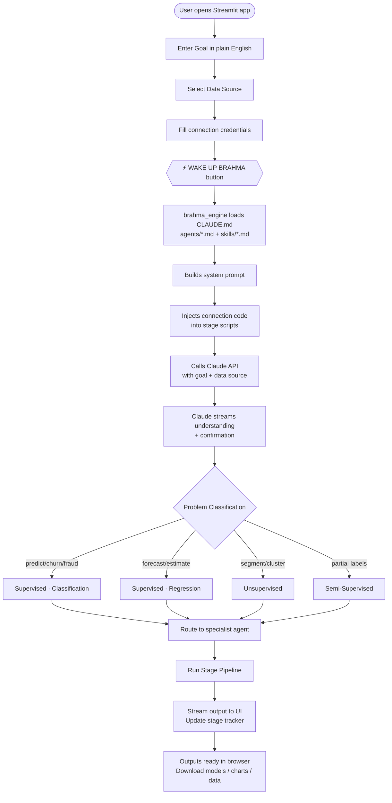
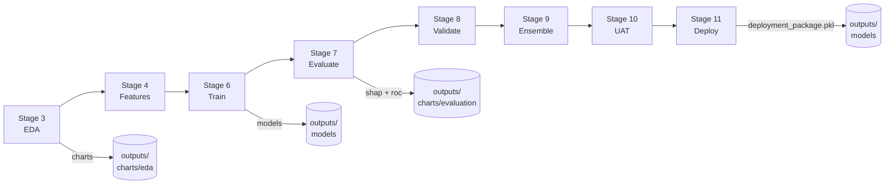
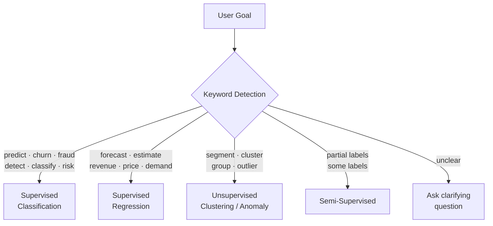

# Brahma — The Creator Intelligence

> *"Tell me your goal and your data source. Nothing else is required."*

Brahma is an autonomous ML super-agent powered by the Claude API. You describe a business problem in plain English, point it at your data, and Brahma runs the full machine learning pipeline — from raw ingestion to a deployed, validated model — through a live Streamlit web UI. No code required.

---

## Table of Contents

- [What is Brahma?](#what-is-brahma)
- [Architecture Overview](#architecture-overview)
- [System Flow](#system-flow)
- [Pipeline Flow](#pipeline-flow)
- [How to Activate](#how-to-activate)
- [Pipeline Stages](#pipeline-stages)
- [Supported Problem Types](#supported-problem-types)
- [Supported Data Sources](#supported-data-sources)
- [Project Structure](#project-structure)
- [Agents](#agents)
- [Skills](#skills)
- [Outputs](#outputs)
- [Deployment](#deployment)
- [Example Session](#example-session)
- [Error Handling](#error-handling)
- [Requirements](#requirements)

---

## What is Brahma?

Brahma is a **web-deployed ML super-agent** — a Streamlit frontend backed by an orchestration engine that loads a system of specialised agents and skills, routes problems automatically, and runs production-quality ML pipelines end-to-end.

**What it handles:**
- A full web UI with 13 data source connectors and masked credential forms
- Automatic problem classification (classification, regression, clustering, semi-supervised)
- End-to-end ML pipeline across 8 executable stages
- Hyperparameter tuning (Optuna), ensembling, cross-validation, SHAP explainability
- UAT testing and deployment packaging
- Downloadable models, charts, and data outputs directly from the browser

---

## Architecture Overview

```
┌─────────────────────────────────────────────────────────────────┐
│                        BRAHMA SYSTEM                            │
│                                                                 │
│  ┌──────────────┐      ┌──────────────────┐                     │
│  │   app.py     │─────▶│  brahma_engine   │                     │
│  │  Streamlit   │      │      .py         │                     │
│  │   Web UI     │◀─────│  Orchestrator    │                     │
│  └──────────────┘      └────────┬─────────┘                     │
│         │                       │                               │
│         │ Goal + Data           │ Loads at startup              │
│         │ Source form           ▼                               │
│         │              ┌─────────────────┐                      │
│         │              │   CLAUDE.md     │                      │
│         │              │   agents/*.md   │  System Prompt       │
│         │              │   skills/*.md   │                      │
│         │              └────────┬────────┘                      │
│         │                       │                               │
│         │                       │ API call                      │
│         │                       ▼                               │
│         │              ┌─────────────────┐                      │
│         │              │  Claude API     │                      │
│         │              │  (Anthropic)    │                      │
│         │              └────────┬────────┘                      │
│         │                       │ Streamed response             │
│         │                       ▼                               │
│         │              ┌─────────────────┐                      │
│         │              │  Stage Scripts  │                      │
│         │              │  stage3 → 11    │                      │
│         │              └────────┬────────┘                      │
│         │                       │                               │
│         ▼                       ▼                               │
│  ┌──────────────────────────────────────┐                       │
│  │           outputs/                   │                       │
│  │  charts/  models/  data/             │                       │
│  └──────────────────────────────────────┘                       │
└─────────────────────────────────────────────────────────────────┘
```

---

## System Flow



---

## Pipeline Flow



---

## How to Activate

### Web App (Streamlit)

Visit your deployed Streamlit URL, fill in your **Goal** and **Data Source**, then click **⚡ WAKE UP BRAHMA**.

### Local / Claude Code

Open Claude Code in this directory and say:

```
Wake Up Brahma
```

Brahma collects your goal and data source, echoes its understanding, and **waits for confirmation before running anything**.

---

## Pipeline Stages

| Stage | Script | Description |
|-------|--------|-------------|
| **Stage 3** | `stage3_eda.py` | Exploratory Data Analysis — distributions, correlations, target analysis |
| **Stage 4** | `stage4_features.py` | Feature Engineering — encoding, scaling, selection, new feature creation |
| **Stage 6** | `stage6_train.py` | Model Training — baseline + XGBoost with Optuna hyperparameter tuning |
| **Stage 7** | `stage7_evaluate.py` | Model Evaluation — ROC, precision-recall, confusion matrix, SHAP |
| **Stage 8** | `stage8_validate.py` | Model Validation — cross-validation, threshold optimisation, drift config |
| **Stage 9** | `stage9_ensemble.py` | Ensembling — stacking, voting, and blending comparison |
| **Stage 10** | `stage10_uat.py` | User Acceptance Testing — prediction checks, schema validation, edge cases |
| **Stage 11** | `stage11_deploy.py` | Deployment Packaging — serialised model, scaler, metadata bundle |

> Stages 1, 2, and 5 are orchestration and routing — handled by the agent system, not standalone scripts.

---

## Supported Problem Types



| Type | Sub-type | Trigger Keywords |
|------|----------|-----------------|
| **Supervised** | Classification | predict, churn, fraud, detect, classify, risk, score |
| **Supervised** | Regression | forecast, estimate, revenue, price, how much, demand |
| **Unsupervised** | Clustering / Anomaly | segment, cluster, group, find patterns, outlier |
| **Semi-Supervised** | — | partial labels, some labels, few labels |

---

## Supported Data Sources

| Category | Connectors |
|----------|-----------|
| **Files** | CSV, Excel, Parquet, JSON, TSV |
| **Databases** | PostgreSQL, MySQL, SQLite |
| **Cloud warehouses** | Snowflake, BigQuery |
| **Object storage** | AWS S3, Azure Blob Storage, Google Cloud Storage |
| **Spreadsheets** | Google Sheets |
| **APIs** | REST (GET / POST) with JSON path extraction |

The engine auto-generates the correct connection code for whichever source is selected — credentials are injected at runtime and never written to disk.

---

## Project Structure

```
Brahma/
│
├── app.py                       # Streamlit web UI — goal form, data source selector,
│                                #   credential forms, stage tracker, output downloads
├── brahma_engine.py             # Core engine — loads .md files, builds system prompt,
│                                #   injects connection code, calls Claude API, runs stages
├── requirements.txt             # All dependencies incl. cloud connectors
├── DEPLOY_README.md             # Step-by-step Streamlit Cloud deployment guide
│
├── CLAUDE.md                    # Brahma identity & activation rules
│
├── agents/                      # Specialist routing agents
│   ├── super_agent.md           # Master orchestrator — single user-facing entry point
│   ├── supervised_learning_agent.md
│   ├── unsupervised_learning_agent.md
│   └── semi_supervised_agent.md
│
├── skills/                      # Reusable capability modules
│   ├── data_ingestion.md
│   ├── data_preprocessing.md
│   ├── eda_analyzer.md
│   ├── feature_engineering.md
│   ├── algorithm_selector.md
│   ├── model_trainer.md
│   ├── model_evaluator.md
│   ├── model_validator.md
│   ├── ensembling.md
│   ├── deployment_tester.md
│   ├── uat_checklist.md
│   └── visualization_style.md
│
├── stage3_eda.py
├── stage4_features.py
├── stage6_train.py
├── stage7_evaluate.py
├── stage8_validate.py
├── stage9_ensemble.py
├── stage10_uat.py
├── stage11_deploy.py
│
├── dashboard.py                 # Local pipeline progress dashboard
├── data/                        # Input data
└── outputs/
    ├── charts/
    │   ├── eda/
    │   ├── training/
    │   ├── evaluation/
    │   ├── validation/
    │   └── ensembling/
    ├── models/                  # .pkl model files
    └── data/                    # .parquet intermediate files + leaderboard.csv
```

---

## Agents

### Super Agent (`agents/super_agent.md`)
The single entry point for all interactions. Handles activation, goal collection, problem classification, data source validation, specialist agent routing, and the final pipeline summary banner. Users never interact with other agents directly.

### Supervised Learning Agent (`agents/supervised_learning_agent.md`)
Runs the full supervised pipeline for classification and regression problems — preprocessing through deployment.

### Unsupervised Learning Agent (`agents/unsupervised_learning_agent.md`)
Handles clustering (K-Means, DBSCAN, hierarchical) and anomaly detection (Isolation Forest, LOF).

### Semi-Supervised Agent (`agents/semi_supervised_agent.md`)
Handles datasets with partial labels using label propagation and self-training.

---

## Skills

| Skill | Purpose |
|-------|---------|
| `data_ingestion` | Reads from any source type with auto-generated connection code |
| `data_preprocessing` | Null handling, outliers, type casting, train/test split |
| `eda_analyzer` | Distribution plots, correlation heatmaps, target analysis |
| `feature_engineering` | Encoding, scaling, interaction features, selection |
| `algorithm_selector` | Picks the right algorithm family for the problem and data size |
| `model_trainer` | Trains baseline + tuned models using Optuna |
| `model_evaluator` | Metrics, SHAP explanations, evaluation charts |
| `model_validator` | Cross-validation, threshold tuning, drift configuration |
| `ensembling` | Stacking, voting, blending — picks best ensemble |
| `deployment_tester` | Validates deployment package before sign-off |
| `uat_checklist` | Schema checks, prediction sanity, edge case assertions |
| `visualization_style` | Consistent chart styling across all outputs |

---

## Outputs

| Output | Location | Description |
|--------|----------|-------------|
| EDA charts | `outputs/charts/eda/` | Target distribution, feature correlations, violin plots |
| Training charts | `outputs/charts/training/` | Learning curves, Optuna history |
| Evaluation charts | `outputs/charts/evaluation/` | ROC, PR curve, confusion matrix, SHAP beeswarm, calibration |
| Validation charts | `outputs/charts/validation/` | CV results, threshold analysis |
| Ensemble charts | `outputs/charts/ensembling/` | Model comparison bar chart |
| Trained models | `outputs/models/` | `.pkl` files for baseline, tuned, and final models |
| Deployment package | `outputs/models/deployment_package.pkl` | Production bundle: model + scaler + metadata |
| Intermediate data | `outputs/data/` | Preprocessed and feature-engineered `.parquet` files |
| Leaderboard | `outputs/data/leaderboard.csv` | All model scores ranked by primary metric |

All outputs are downloadable directly from the Streamlit UI after the pipeline completes.

---

## Deployment

### Streamlit Cloud (recommended)

1. Push repo to GitHub (`akv803101/Brahma`)
2. Go to [streamlit.io/cloud](https://streamlit.io/cloud) → **New app**
3. Set **Main file path** to `app.py`
4. Go to **Settings → Secrets** and add:
```toml
ANTHROPIC_API_KEY = "sk-ant-your-key-here"
```
5. Click **Deploy** — live at `brahma.streamlit.app`

### Local

```bash
pip install -r requirements.txt
export ANTHROPIC_API_KEY=sk-ant-your-key-here
streamlit run app.py
# Opens at http://localhost:8501
```

### Security notes

| Layer | Protection |
|-------|-----------|
| Anthropic API key | Streamlit Cloud secrets — never in code |
| DB passwords | `type="password"` fields — masked in UI |
| Service account JSON | Held in session memory only, never logged |
| Temp uploaded files | Deleted immediately after pipeline completes |

---

## Example Session

```
User   : Wake Up Brahma

Brahma : Brahma is awake.
         I am ready to transform your data into intelligence.
         Tell me your goal and your data source.
         Nothing else is required.

User   : Goal: Predict which credit card customers will churn next month.
         Data: data/credit_card_customers.csv

Brahma : Here is what I understand:

         Goal   : Binary classification — predict customer churn (yes/no)
         Data   : FILE — credit_card_customers.csv (5.2 MB)
         Output : Trained model, evaluation charts, SHAP explanations, deployment package

         Confirm: Is this correct? (yes / no)

User   : yes

Brahma : Problem Type : SUPERVISED
         Sub-type     : Classification
         Routing to   : supervised_learning_agent
         Starting pipeline. I will announce each stage as I enter it.

         STAGE 3 — EDA COMPLETE
         STAGE 4 — FEATURES COMPLETE
         STAGE 6 — TRAIN COMPLETE
         STAGE 7 — EVALUATE COMPLETE
         STAGE 8 — VALIDATE COMPLETE
         STAGE 9 — ENSEMBLE COMPLETE
         STAGE 10 — UAT COMPLETE
         STAGE 11 — DEPLOY COMPLETE

         ╔══════════════════════════════════════════════════════════╗
         ║              BRAHMA PIPELINE COMPLETE                    ║
         ╠══════════════════════════════════════════════════════════╣
         ║  Goal        : Predict customer churn                    ║
         ║  Stages run  : 8/8                                       ║
         ║  Final model : XGBoost (tuned, stacked ensemble)         ║
         ║  Test score  : ROC-AUC = 0.974                           ║
         ╚══════════════════════════════════════════════════════════╝
```

---

## Error Handling

Brahma follows four non-negotiable principles:

1. **Never crash silently** — every error shows a plain English explanation in the UI.
2. **Never lose completed work** — all outputs are saved before stopping on a blocker.
3. **Always offer recovery** — on any failure: `Retry / Skip / Stop?`
4. **Never guess** — if goal or data source is ambiguous, Brahma asks before proceeding.

Common errors and fixes:

| Error | Cause | Fix |
|-------|-------|-----|
| `Missing API Key` | `ANTHROPIC_API_KEY` not set | Add to Streamlit Cloud Secrets |
| `Invalid API Key` | Wrong or revoked key | Verify at console.anthropic.com |
| `Credit balance too low` | Anthropic account out of credits | Add credits at Plans & Billing |
| `File not found` | Wrong file path | Check path and re-upload |

---

## Requirements

Install all dependencies:

```bash
pip install -r requirements.txt
```

Key packages: `streamlit`, `anthropic`, `pandas`, `numpy`, `scikit-learn`, `xgboost`, `optuna`, `shap`, `snowflake-connector-python`, `google-cloud-bigquery`, `google-cloud-storage`, `boto3`, `azure-storage-blob`

---

## License

This project is proprietary. All rights reserved.  
BRAHMA © 2026 · IntelliBridge · Built by Aakash Verma
